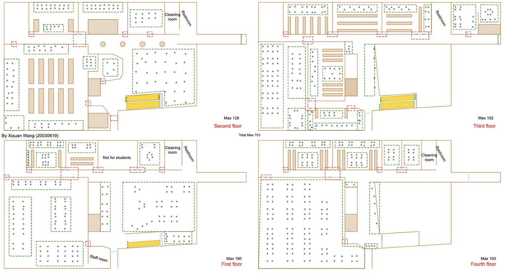
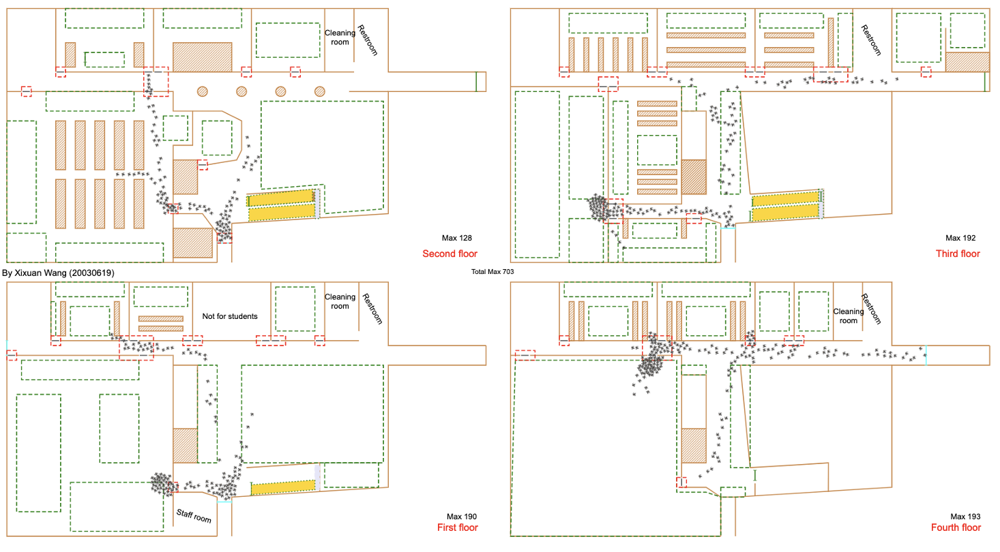
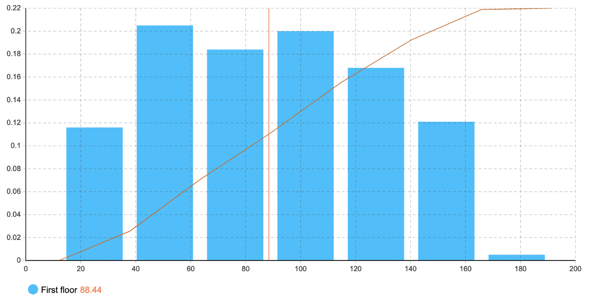

## 🏠 UNNC (University of Nottingham, Ningbo, China) Library Simulation in 2019 📖

### Brief Introduction

* This project is designed to be run on the simulation platform named ```AnyLogic```.  
  
* The aim of this project is to simulate the practical evacuation of students studying at the library in terms of emergency.  

* Related statistic results and the interim research report are also included.
  
* This project is memorable in a way because in 2020 summer, this library was forever closed, 
and the building would be further used for other purposes. I really missed the time in the first two years (2017-2019) I spent there.

* A brand-new larger library will soon be established for students in UNNC to study in (Already established in September, 2020).  
  
* Relevant construction information about this library may only be found in this project :) <br><br>

### Project Snapshots 

<br><br><br><br>
<br><br><br><br>
<br><br><br><br>
